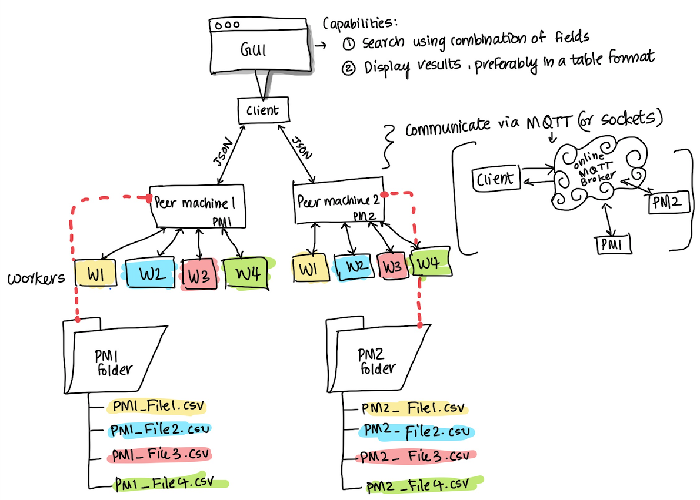

###### CS-341: Parallel Computing & Distributed Systems   Spring 2021   Northeastern Illinois University   Final Project
###A Distributed Query System 

**1.** The `App.Java` is the entry point of the program:

- Creates a Client object to launch GUI
    - stuff stuff stuff
    - stuff stuff stuff

- Creates and launches two Peer Machines
    - In the for loop:
      - Uses the actor model (from assignment 5) to create the ActorSystem
      - Each ActorRef calls `PeerMachine` class to create a peer machine each. They each take two parameters 1) the class being used to create the actor and 2) the optional name being given to that actor, which is "PM i" in this case.
    - This will enable each Peer Machines to communicate with their respective `worker` via an ActorSystem

- Handles an MQTTExcpetion by printing the Exception details

**2.** `Client.java`

**3.** `PeerMachine.java`

- **prestart()** is accessed when the PeerMachine "PM i" is initially created and started.
  - As part of setting up the PeerMachine, in the for loop it is: 
    - Creating 4 workers 
    - Converting the initial message from Message Object to JSON 
    - sending the JSON formatted data to appropiate worker (worker 1 to 4)
  - Finally, it also initializes the MQTT Client by calling **initializeMQTTStuff()**
  
- **initializeMQTTStuff()** 

**4.** `Worker.java`
- **prestart()** simply starts the worker
- **onReceive()**
- **postStop()**

**5.** `Message.java`

**6.** All `.csv` files contains data for 1,0000 workers (Name - string, salary - float, address - string, and age - integer)., which are formatted in the following form:

| First Name      | Last Name | Address                               | Salary   | Age  |
| :---            |    :----: |          ---:                         |     ---: | ---: |
| Harry           | Potter    | 05180 Sparks Run Port Keith. MO 48921 | 58000    | 32   | 
| Samantha        | Jones     |949 Cortez Path Santanafurt. NV 58500  | 41000    | 38   |

